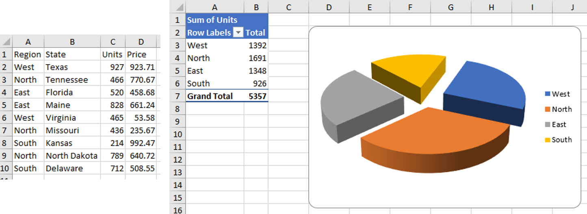

# PowerShell and Excel 


<br/>

[](https://www.powershellgallery.com/packages/ImportExcel)
[](https://www.powershellgallery.com/packages/ImportExcel)
[](https://github.com/dfinke/ImportExcel/tree/70ab9e46c776e96fb287682d5b9b4b51a0ec3bac/LICENSE.txt)
<a href="https://www.paypal.com/paypalme/DougCharlesFinke"></a>

# Overview

Automate Excel with PowerShell without having Excel installed. Works on Windows, Linux and MAC. Creating Tables, Pivot Tables, Charts and much more just got a lot easier.

## Examples 
Check out [more than 100 examples](Examples/) on ways use this PowerShell Excel module.

# Basic Usage
## Installation

```powershell
Install-Module -Name ImportExcel
```

## Create a spreadsheet
Here is a quick example that will create spreadsheet file from CSV data. Works with JSON, Databases, and more.

```powershell
$data = ConvertFrom-Csv @"
Region,State,Units,Price
West,Texas,927,923.71
North,Tennessee,466,770.67
East,Florida,520,458.68
East,Maine,828,661.24
West,Virginia,465,053.58
North,Missouri,436,235.67
South,Kansas,214,992.47
North,North Dakota,789,640.72
South,Delaware,712,508.55
"@

$data | Export-Excel .\salesData.xlsx
```


## Read a spreadsheet

Quickly read a spreadsheet document into a PowerShell array.

```powershell
$data = Import-Excel .\salesData.xlsx
```

```powershell
Region State        Units Price
------ -----        ----- -----
West   Texas        927   923.71
North  Tennessee    466   770.67
East   Florida      520   458.68
East   Maine        828   661.24
West   Virginia     465   053.58
North  Missouri     436   235.67
South  Kansas       214   992.47
North  North Dakota 789   640.72
South  Delaware     712   508.55
```

## Add a chart to spreadsheet

Chart generation is as easy as 123. Building charts based on data in your worksheet doesn't get any easier.

Plus, it is automated and repeatable.

```powershell
$data = ConvertFrom-Csv @"
Region,State,Units,Price
West,Texas,927,923.71
North,Tennessee,466,770.67
East,Florida,520,458.68
East,Maine,828,661.24
West,Virginia,465,053.58
North,Missouri,436,235.67
South,Kansas,214,992.47
North,North Dakota,789,640.72
South,Delaware,712,508.55
"@

$chart = New-ExcelChartDefinition -XRange State -YRange Units -Title "Units by State" -NoLegend

$data | Export-Excel .\salesData.xlsx -AutoNameRange -ExcelChartDefinition $chart -Show
```


## Add a pivot table to spreadsheet

Categorize, sort, filter, and summarize any amount data with pivot tables. Then add charts.

```powershell
$data = ConvertFrom-Csv @"
Region,State,Units,Price
West,Texas,927,923.71
North,Tennessee,466,770.67
East,Florida,520,458.68
East,Maine,828,661.24
West,Virginia,465,053.58
North,Missouri,436,235.67
South,Kansas,214,992.47
North,North Dakota,789,640.72
South,Delaware,712,508.55
"@

$data | Export-Excel .\salesData.xlsx -AutoNameRange -Show -PivotRows Region -PivotData @{'Units'='sum'} -PivotChartType PieExploded3D
```



# Bonus Points

## Create a separate CSV file for each Excel sheet

Do you have a Excel file with multiple sheets and you need to convert each sheet to CSV file?

### Problem Solved

The `yearlyRetailSales.xlsx` has 12 sheets of retail data for the year.

This single line of PowerShell converts any number of sheets in an Excel workbook to separate CSV files.

```powershell
(Import-Excel .\yearlyRetailSales.xlsx *).GetEnumerator() |
ForEach-Object { $_.Value | Export-Csv ($_.key + '.csv') }
```

# Getting Started

## Videos

- [Export-Excel Hello World](https://youtu.be/fvKKdIzJCws?list=PL5uoqS92stXioZw-u-ze_NtvSo0k0K0kq)
- [Make Excel Data Pop](https://youtu.be/gQaYI5hxqM4?list=PL5uoqS92stXioZw-u-ze_NtvSo0k0K0kq)
- [Slice And Dice Data](https://youtu.be/kzllxvqr3TY?list=PL5uoqS92stXioZw-u-ze_NtvSo0k0K0kq)
- [Lightning talk - PowerShell Excel Module](https://youtu.be/znVu2q11Rp4?list=PL5uoqS92stXioZw-u-ze_NtvSo0k0K0kq)

## More Videos

- [Look smarter: deliver your work in Excel](https://youtu.be/tu8Mfkwi8zI) - James O'Neill
- [Module Monday: ImportExcel](https://youtu.be/rBA_IeTmCb8?t=5) - Adam Driscoll
- [Tutorials Excel Module Part 1](https://youtu.be/2cwBuYbZ3To)
- [Tutorials Excel Module Part 2](https://youtu.be/8ojg-qjOnVI)
- [Tutorials Excel Module Part 3](https://youtu.be/3IgASPD0UrQ)
- [PowerShell Excel - Invoke-ExcelQuery](https://youtu.be/_7xuhsZm0Ao)
- [Powershell Excel - Data Validation](https://youtu.be/NGhahuY8j1M)
- [Creating Dashboards xPlatform](https://youtu.be/qMWkZt6ikgM)

## Articles

- [Creating beautiful Powershell Reports in Excel](https://dfinke.github.io/powershell/2019/07/31/Creating-beautiful-Powershell-Reports-in-Excel.html)
- [PowerShell Excel and Conditional Formatting](https://dfinke.github.io/powershell/2020/05/02/PowerShell-Excel-and-Conditional-Formatting.html)
- [Learn to Automate Excel like a Pro with PowerShell](https://dfinke.github.io/powershell/2019/08/29/Learn-to-Automate-Excel-like-a-Pro-with-PowerShell.html)

## Contributing
Contributions are welcome! Open a pull request to add a feature, fix a bug, or open an issue to discuss a new feature or change.